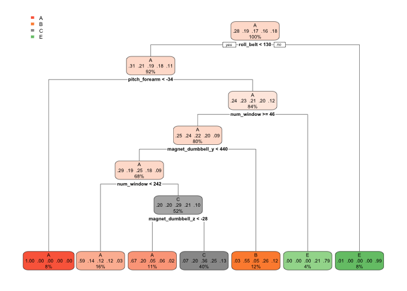

# index.Rmd
Yoan Bidart  
9/22/2017  


# Overview
We build a model to predict a type of activity from accelerometers' data. The data form this project comes from this source :  http://web.archive.org/web/20161224072740/http:/groupware.les.inf.puc-rio.br/har. We created a tree and a random forest model on our train dataset and then calculated the accuracy on a test set. 

# Background 
Using e-devices to collect data about personal activity is now mainstream. A group collected the data from people doing an activity to find patterns to recognize if barbells exercises were made correctly. More information is available from the website here: http://web.archive.org/web/20161224072740/http:/groupware.les.inf.puc-rio.br/har (see the section on the Weight Lifting Exercise Dataset).

# Downloading the data

```r
download.file("https://d396qusza40orc.cloudfront.net/predmachlearn/pml-training.csv", "training.csv")
download.file("https://d396qusza40orc.cloudfront.net/predmachlearn/pml-testing.csv", "testing.csv")
```

# Loading and processing the data

```r
data <- read.csv("training.csv")
validating <- read.csv("testing.csv")
library(caret)
```

```
## Warning: package 'caret' was built under R version 3.4.1
```

```
## Loading required package: lattice
```

```
## Loading required package: ggplot2
```

```r
library(rpart)
library(rpart.plot)
library(randomForest)
```

```
## randomForest 4.6-12
```

```
## Type rfNews() to see new features/changes/bug fixes.
```

```
## 
## Attaching package: 'randomForest'
```

```
## The following object is masked from 'package:ggplot2':
## 
##     margin
```

```r
set.seed(202020)
# removing useless variables : time and user name and window
alldata <- data[,-(2:7)]
# remove variables that are mostly NA
NaCol <- sapply(alldata, function(x) mean(is.na(x)))>.95
alldata <- alldata[,NaCol==FALSE]
# remove values that have low variance
nzv <- nearZeroVar(alldata)
alldata <- alldata[,-nzv]
```
We did remove a bunch of variables, as they were not useful such as user description and time series, variables which were mostly NA, and low variance ones. 

# Creating training and testing set 
We used cross validation

```r
inTrain <- createDataPartition(alldata$classe, p=.7, list=FALSE)
train <- alldata[inTrain,]
test <- alldata[-inTrain,]
```

# Prediction models and accuracy

## Regression tree

```r
fit1 <- rpart(classe~., data=train, method="class")
rpart.plot(fit1)
```

<!-- -->

```r
pred1 <- predict(fit1, test, type="class")
confusionMatrix(pred1, test$classe)$overall
```

```
##       Accuracy          Kappa  AccuracyLower  AccuracyUpper   AccuracyNull 
##      0.9996602      0.9995701      0.9987729      0.9999588      0.2844520 
## AccuracyPValue  McnemarPValue 
##      0.0000000            NaN
```
Accuracy is quite good but we tried to use random forest to see if it can be better.

## Random forest

```r
fit2 <- randomForest(classe~., data=train, model="class")
pred2<- predict(fit2, test, type="class")
confusionMatrix(pred2, test$classe)$overall
```

```
##       Accuracy          Kappa  AccuracyLower  AccuracyUpper   AccuracyNull 
##      1.0000000      1.0000000      0.9993734      1.0000000      0.2844520 
## AccuracyPValue  McnemarPValue 
##      0.0000000            NaN
```
This model seems fine to predict the quiz.

# Prediction quizz

```r
quiz <- predict(fit2, validating, model="class")
head(quiz)
```

```
## 1 2 3 4 5 6 
## A A A A A A 
## Levels: A B C D E
```
Thank you for reading this far !
